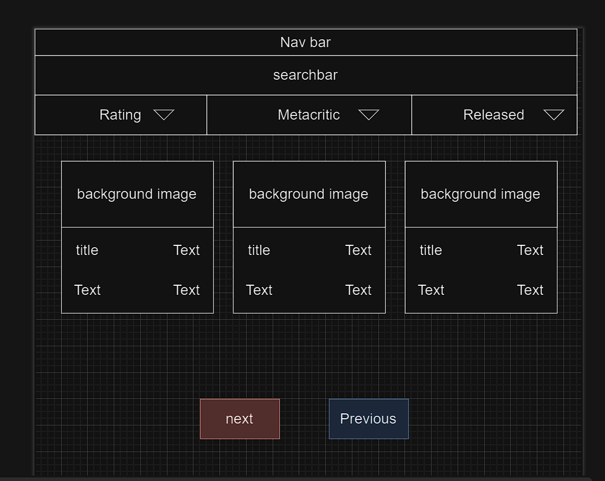
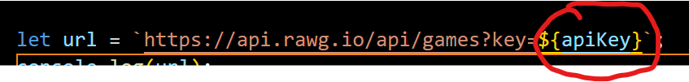

# Gaming Paradise

The Game Catalog is a simple web application that allows users to browse and search for games. It fetches game data from the RAWG API and displays it in a visually appealing manner, including game details such as name, rating, release date, and metacritic score. The application will also provide features like pagination, sorting, and filtering to enhance the user experience.

## Table of Contents

- [Wireframe](#wireframe)
- [Hosted Site](#hosted-site)
- [Features](#features)
- [Built With](#built-with)
- [Future features](#future-features)

## Wireframe 

## Hosted Site

The web site is hosted on GitHub Pages on the url: https://dimifabbridf96.github.io/VideoGamesApi/

to access the full functionality of the web site is needed an API key that is kept secret using a different file that is accessible only in development, to improve the security of the website,and not in production because not uploaded using .gitignore.
I will provide the API key in the planning analysis sheet to be replaced in the url variable

## Features

- Fetch and display game data from the RAWG API.
- Display game details such as name, rating, release date, and metacritic score.
- Implement pagination to navigate through multiple pages of game data.
- Allow users to search for games by name.
- Sort games by rating, release date, and metacritic score.
- Leave a feedback

## Built With

1. HTML5 for structuring the web page.
2. CSS3 for styling the web page.
3. JavaScript (ES6) for implementing the dynamic functionality and interacting with the API.

## Future features
1. Implement user authentication and authorization to allow users to save their favorite games.
2. Add game recommendations based on user preferences and browsing history.
3. Implement a rating system for users to rate games.
4. Add a wishlist feature for users to save games they want to play in the future.
5.Implement a review system for users to leave reviews and ratings for games.
6. Add platform and genre in game description

